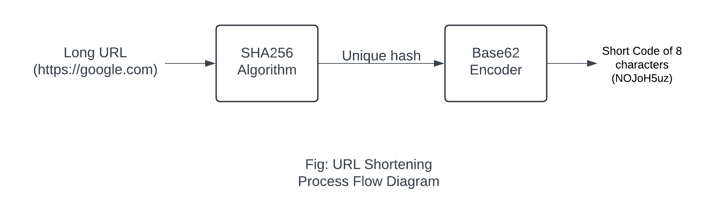

# URL Shortener

A simple URL shortener service in Golang using SHA256 Algorithm and Base62 Encoding.



## Requirements
- [Golang](https://go.dev/) - Project uses Go v1.22.2

## Packages
- [Gin](https://gin-gonic.com) - Go Web Framework
- [base62](https://github.com/jxskiss/base62) - Base62 encoder
- [crypto/sha256](https://pkg.go.dev/crypto/sha256) - SHA256 hash algorithm
- [govalidator](https://github.com/asaskevich/govalidator) - URL validation
- [Testify](https://github.com/stretchr/testify) - Tools to better test code

## Usage :

```bash
user@main:~$ go run main.go

# or
user@main:~$ go build main.go
user@main:~$ ./main
```
After running the commands, the server runs on port `8080`; [http://localhost:8080](http://localhost:8080)
___
## **Run Tests**
Test Files:
* [api/server_test.go](./api/server_test.go) - /shorten and /{shortCode} endpoint tests
* [utils/url_test.go](./utils/url_test.go) - URL validation test
```bash
# Run all test
user@main:~$ go test ./...
```
## API Endpoints
* [/shorten](#create-short-url) Create Short URL
* [/{shortCode}](#redirect-to-original-url) Redirect to original URL

## Create short URL
#### POST /shorten

**Body**

|          Name | Required |  Type   |
| -------------:|:--------:|:-------:| 
|     `url` | required | url-string |

**Responses**
<table>
<tr style="width:50%">
<td>

Success 
```json
{
    "short_url": "http://localhost:8080/l2kT9L8K"
}
```
</td>
<td style="width:50%">

Error
```json
{
    "message": "invalid url"
}
```
</td>
</tr>
</table>

## Redirect to original URL
#### GET /{shortCode}

**Parameters**

|          Name | Required |  Type   |
| -------------:|:--------:|:-------:| 
|     `shortCode` | required | string |

**Responses**

On Success redirects to the original long URL

On Error
```json
{
    "message": "short code not found"
}
```